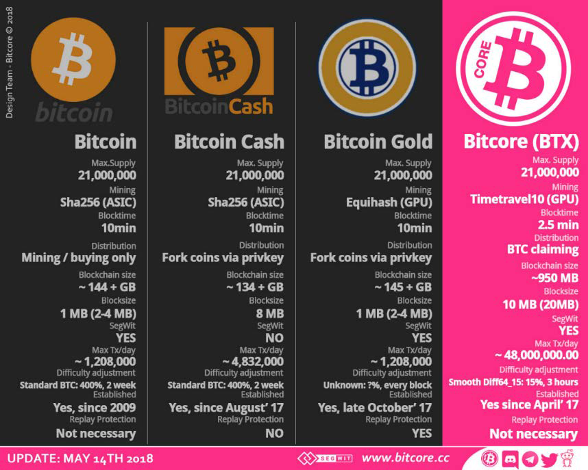
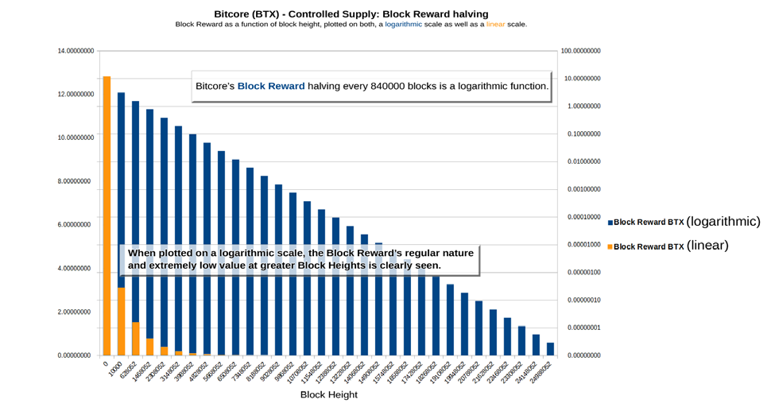
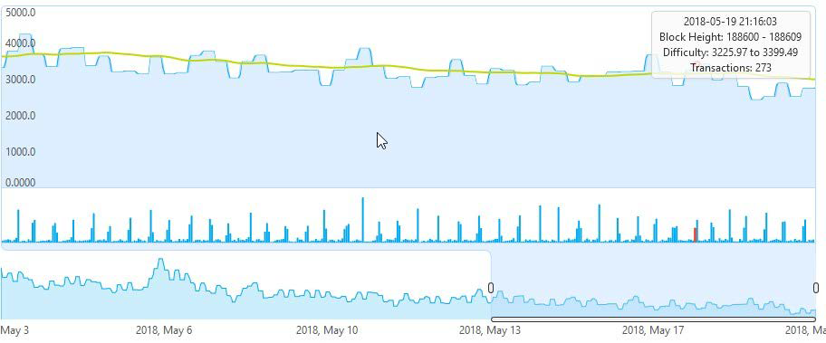

# Kapitel 3

## Lösung und technische Spezifikation

Bitcore zeichnet sich durch wichtige Innovationen aus, die es als alltägliches Zahlungsmittel sowohl im privaten als auch im geschäftlichen Kontext besonders gut einsetzbar machen. Jede dieser Innovationen, sowie ihre Rolle bei der Steigerung der Effizienz und Benutzerfreundlichkeit von Bitcore, wird in diesem Abschnitt erläutert.

Für einen schnellen Überblick sind die wichtigsten technischen Spezifikationen von Bitcore im Folgenden zusammengefasst:

**Name Bitcore**

**Ticker BTX**

* Gestartet am 24. April 2017
* Maximale Coinanzahl von 21 Millionen
* Blockgröße 10MB (20MB SegWit)
* Durchschnittliche Blockzeit von 2,5 Minuten
* Aktuelle Blockchaingröße ca. 950 MB
* Timetravel10 (GPU) Mining Algorithmus
* SegWit und Bloom aktiviert
* Reibungslosen Schwierigkeitsanpassung durch diff64_15 Algorithmus
* Faire Verteilung durch BTC Claiming und Airdrops

> "[Bitcore] ist innovativ, indem es mit Dingen aufräumt" -- Jimmy Song (vii), Bitcoin Hauptentwickler

## 3.1 Coin Verteilung
Die maximale Anzahl der Coins, die auf der Bitcore-Plattform erzeugt werden, ist auf 21 Millionen begrenzt. Diese Zahl wurde bewusst gewählt, um die gleiche Gesamtmenge an Coins wie Bitcoin (BTC)  zu entsprechen.

Diese begrenzte Coinmenge ist das Ergebnis des Halbierungsalgorithmus von Bitcoin, der die Coinbase Belohnung für Miner alle 210.000 Blöcke um 50% reduziert und die Anzahl der neu gewonnenen Coins etwa alle vier Jahre reduziert, bis sie im Jahr 2140 etwa Null erreicht.

Die Block-Belohnung von Bitcore war identisch mit der Bitcoin-Block-Belohnung für die ersten 10.000 Blöcke: 12,5 BTX pro Block, mit einer Blockzeit von 10 Minuten. Anschließend reduzierte ein Update die Belohnung auf 3,125 BTX pro Block bei einer durchschnittlichen Blockzeit von 2,5 Minuten.

Bitcore wendet den gleichen Halbierungsalgorithmus auf seine Coinbase Belohnungen an, jedoch in Abständen von 840.000 Blöcken. Somit ist die Anzahl von Bitcores ebenso begrenzt wie die Anzahl von Bitcoins.

Die folgende Grafik zeigt die Halbierung der Block-Belohnung von Bitcore:

Diese Halbierung der Belohnung in festen Abständen von Blöcken führt zu einer vorgegebenen Gesamtmenge an Coins, einem Konzept namens "Controlled Supply".

## 3.2 Blockchain und Algorithmen
Bitcore verwendet wie Bitcoin einen Proof-of-Work-Algorithmus. Die Schwierigkeitsanpassung wird jedoch auf innovative Weise gelöst, indem der Schwierigkeitsanpassungsalgorithmus "Core Shield 64_15" wie unten beschrieben verwendet wird.

Ein weiterer entscheidender Unterschied von Bitcore gegenüber Bitcoin sind die reduzierten Blockzeiten, ein Viertel der Blockzeiten von Bitcoin, die Bitcore sowohl benutzerfreundlicher als auch sicherer machen, wie weiter unten in diesem Abschnitt beschrieben. Gleichzeitig ist die Blockgröße deutlich größer, was wiederum zu einer höheren Transaktionsgeschwindigkeit und einer besseren Benutzerfreundlichkeit beiträgt.

Schließlich machen die Aktivierung von SegWit - 4,5 Monate früher als bei der Bitcoin Blockchain - und die Kompatibilität mit dem Lightning Network Bitcore zu einem Zahlungsmittel, das ideal auf die Bedürfnisse von Privatpersonen und Unternehmen von morgen ausgerichtet ist.

### 3.2.1 Reibungslose Schwierigkeitsanpassung durch den diff64_15 Algorithmus
Bei auf dem Proof-of-Work-Algorithmus basieren Kryptowährungen dient die Schwierigkeitsanpassung, mit der die Miner den nächsten Block finden können, dazu konsistente Blockzeiten zu gewährleisten. Ohne Schwierigkeitsanpassung würden die Blockzeiten mit zunehmender Anzahl von Minern abnehmen, da dies die Wahrscheinlichkeit erhöhen würde, dass der richtige Hashing-Wert von einem der vielen Miner gefunden wird.
Daher wird bei der Schwierigkeitsanpassung der Schwierigkeitsgrad der Entdeckung des nächsten Blocks erhöht, wenn viele Miner auf der Blockchain aktiv sind, und verringert, wenn weniger Miner aktiv sind.

Bei Bitcoin wird der Schwierigkeitsgrad alle 2016 Blöcke angepasst. Bei einer Blockzeit von ca. 10 Minuten entspricht dies einer Anpassung etwa alle zwei Wochen - eine eher schleppende Rate, die nicht auf kurzfristige Erhöhungen oder Verringerungen der Mining-Aktivität reagiert. Solche kurzfristigen Schwankungen der Miningaktivitäten werden jedoch häufig beobachtet, wenn Miner zwischen Bitcoin und seinen Protokoll-Forks hin und her wechseln und nach dem besten Verhältnis zwischen Mining-Aufwand (bestimmt durch Schwierigkeitsgrad) und Rendite suchen.

Um diese Herausforderung zu lösen, hat Bitcore die Schwierigkeitsanpassungsmethode von Bitcoin durch einen neuartigen Algorithmus namens "Core Shield 64_15" ersetzt.

Beim "Core Shield 64_15" wird die Blockschwierigkeit alle 64 Blöcke neu eingestellt. Bei einer Bitcore-Blockzeit von nur 2,5 Minuten erfolgt die Schwierigkeitsanpassung alle 2 Stunden und 40 Minuten. Dies macht die Blockschwierigkeit von Bitcore reaktionsschneller als die von Bitcoin, aber gleichzeitig werden zu turbulente kurzfristige Anpassungen vermieden: Die Schwierigkeit wird bei jeder Neuanpassung um nicht mehr als 15% verändert, was zu allmählichen und nicht zu dramatischen Veränderungen führt.

Der Schwierigkeitsanpassungsalgorithmus von Bitcore ist daher nicht nur effizienter, sondern führt auch zu vorhersehbareren Blockzeiten und sichert das Netzwerk zusätzlich gegen Double-Spending-Angriffe, die in Zeiten unverhältnismäßig geringer Hashing-Probleme mit größerer Wahrscheinlichkeit erfolgreich sind.

### 3.2.2 Kürzere Blockzeiten
Das Bitcore Protokoll ist so konzipiert, dass es eine Blockzeit von 2,5 Minuten aufweist - ein Viertel der 10 Minuten Blockzeiten von Bitcoin.

Kürzere Blockzeiten sind aus verschiedenen Gründen von Vorteil.

Die erste ist, dass sie schnellere Bestätigungen ermöglichen. Jede Transaktion in der Blockchain beginnt ihre Existenz als unbestätigte Transaktion, die schließlich von Minern aufgegriffen wird, die um den nächsten Block konkurrieren. Jedes Mal, wenn ein gültiger Block auf der Blockchain erstellt wird, gelten die darin enthaltenen Transaktionen als bestätigt.

Da mehrere aktuell gültige Blöcke mit unterschiedlichen bestätigten Transaktionen parallel auf der Blockchain existieren können, beweist erst die Erstellung weiterer Blöcke nach dem aktuellen Block, dass eine Transaktion tatsächlich Teil der aktiven Blockchain, d.h. der längsten aktuell existierenden Blockchain, geworden ist. Diese Richtlinie ist Teil des Proof-of-Work-Konsensmechanismus zur Verhinderung von Double-Spending-Angriffe durch böswillige Teilnehmerknoten: Der Arbeitsaufwand (und damit die Energie), einen einzelnen Block mit einer betrügerischen Transaktion zu erstellen, kann für einen Angreifer noch überschaubar sein. Diese betrügerische Transaktion wird jedoch langfristig nicht Teil der aktiven Blockchain sein, es sei denn der Angreifer kann noch wesentlich mehr Arbeit aufwenden, um danach eine ausreichende Anzahl von Blöcken zu erstellen, damit diese Blockchain zur längsten Blockchain wird.

Aus diesem Grund werden viele Händler und Unternehmen, die Kryptozahlungen akzeptieren, auf mehr als einen gültigen Block warten bis sie eine bestimmte Transaktion als bestätigt akzeptieren. Im Allgemeinen besteht bei Zahlungen mit höheren Beträgen ein höheres Manipulationsrisiko und damit längere Bestätigungszeiten, um die Sicherheit des Händlers zu gewährleisten.

Blockzeiten von 10 Minuten wurden ursprünglich von Satoshi Nakamoto gewählt, um das Bitcoin-Netzwerk in seiner Größe von vor fast 10 Jahren zu sichern. Seitdem ist das Netzwerk erheblich gewachsen, was es für böswillige Akteure schwieriger macht, betrügerische Transaktionen in das Netzwerk einzubringen.

Vitalik Buterin, der Gründer von Ethereum argumentiert, dass kürzere Blockzeiten besser sind als längere (viii), weil sie eine höhere Granularität der Informationen bieten: Korrekte aktive Blockchains werden schneller erkannt und gegenüber falschen Blockchains bevorzugt, mit der Folge, dass ein akzeptables Sicherheitsniveau für kleine bis mittlere Transaktionen früher erreicht wird. Die Verkürzung der Blockzeiten erhöht jedoch das Zentralisierungsrisiko von Proof-of-Work basieren Blockchains und gibt größeren Teilnehmern deutlich mehr Macht, das Netzwerk zu manipulieren. Blockzeiten können daher nicht beliebig reduziert werden, sondern müssen unter Berücksichtigung dieser gegenläufigen Tendenzen sorgfältig konzipiert werden.

Angesichts all dieser Überlegungen hat sich Bitcore entschieden die Vorteile, die mit einer moderaten Reduzierung der Gesamtblockzeit auf 2,5 Minuten einhergehen, voll auszuschöpfen.

### 3.2.3 Größere Blockgröße
Die Blöcke von Bitcore haben derzeit eine Größe von 10 MB, ohne Berücksichtigung des zusätzlichen Speicherplatzes, der durch das "Reweighing" der Daten aufgrund von SegWit entsteht, das die Größe auf 20 MB vergrößert. Somit kann Bitcore 80 MB in Blöcken (davon 40 MB durch SegWit) im gleichen Intervall produzieren, in dem Bitcoin 2 MB (1 MB ohne SegWit) produziert.

Größere Blöcke können mehr Transaktionen enthalten, was bei konstanter Blockzeit einem schnelleren Transaktionsdurchsatz entspricht. Der Transaktionsdurchsatz war schon immer ein kritisches Thema im Hinblick auf die Wettbewerbsfähigkeit von Kryptowährungen gegenüber Fiat-Zahlungslösungen: Das etablierte VISA kann 1.700 Transaktionen pro Sekunde (TPS) und PayPal mindestens 115 TPS verarbeiten.

Mit aktiviertem SegWit kann Bitcoin etwa 11 TPS verarbeiten, wobei es für sehr kurze Zeitspannen zu Spitzenwerten von bis zu 20 TX/Sekunde in der Lage ist.

Um eine breite Einführung von Krypto Zahlungsmethoden zu ermöglichen, muss die Skalierbarkeit von Blockchain-Netzwerken offensichtlich verbessert werden, bei gleichzeitig steigendem Durchsatz. Zwei Lösungen für diese Herausforderung werden häufig diskutiert: Erhöhung der Blockgröße oder Einführung einer Off-Chain-Skalierungslösung wie dem Lightning Network.

Die Bitcore-Community hat sich dafür entschieden, die Blockgröße auf 10 MB zu erhöhen, und bei einem Durchschnitt von 224 Bytes/TX kann die BTX-Blockchain etwa 310 TX/Sekunde verarbeiten. Mit SegWit wird die potenzielle maximale Blockgröße auf 20 MB weiter erhöht, und die BTX-Blockchain kann 550 TX/Sekunde unter optimalen Bedingungen verarbeiten, auch ohne dabei zu berücksichtigen, dass zusätzliche Transaktionen über das Lightning Network off chain geroutet werden können.

Bitcore hat sich als sehr leistungsfähig erwiesen eine große Anzahl von Transaktionen in kurzer Zeit abzuwickeln, als am 2. November 2017, nach Aktivierung des Hybrid-Forks, etwa 5 Millionen Transaktionen innerhalb weniger Tage verarbeitet wurden (siehe Abschnitt 2.2 des vorliegenden Whitepapers).

### 3.2.4 Aktivierung von Segregated Witness (SegWit)
Segregated Witness (SegWit) wurde im April 2017 auf der Bitcore Blockchain mit Block #3.000 aktiviert - ein halbes Jahr früher als bei Bitcoin. Vor der Aktivierung erstellten die Bitcore Timetravel10 Miner erfolgreich SegWit-konformen Blöcken.

Segwit bietet mehrere unmittelbare Vorteile:
* Eliminierung der unerwünschten Verformbarkeit von Transaktionen
* Kapazitätssteigerung
* Gewichtung der Daten basierend darauf, wie sich diese auf die Leistung der Netzwerk-Knoten auswirken
* Signature Werterhaltung
* Lineare Skalierung von sighash Operationen
* Erhöhte Sicherheit für Multisig
* Effizientere Sicherheit der Netzwerk-Knoten (Full-Nodes)
* Skript-Versionierung

### 3.2.5 Lightning Network Kompatibilität
Das Lightning Network (ix) ist ein Überweisungsnetzwerk, das auf einer Schicht oberhalb der Bitcore-Blockchain arbeitet. Durch die Verwendung der Smart Contract-Funktionalität ermöglicht es Sofortzahlungen in einem Netzwerk von Teilnehmern, ohne dass auf die Bestätigung gewartet werden muss, wie in den vorherigen Abschnitten dieses Whitepapers beschrieben.

Neben der sofortigen Zahlungsabwicklung bietet das Lightning Network weitere Vorteile:
* Erhöhte Skalierbarkeit als Nebeneffekt von Sofortzahlungen
* Geringere Kosten, was diese Lösung auch für Kleinstbeträge (Micropayments) attraktiv macht.
* Ermöglicht blockchainübergreifende atomare Swaps außerhalb der Blockchain mit unterschiedlichen Konsensregeln der Blockchain.
* Bitcore ist voll kompatibel mit dem Lightning Network und unterstützt daher sowohl Sofortzahlungen als auch Micropayments.

### 3.2.6 Geringe Gebühren
Mit einer durchschnittlichen Gebühr von $0,0003 USD pro Kilobyte und einer medianen Gebühr von $0,0002 USD pro Kilobyte sind die Gebühren von Bitcore deutlich niedriger als die Gebühren anderer wichtiger Kryptowährungen (siehe auch Abbildung 4). Da 1 Kilobyte etwa 3 Transaktionen gleichkommt, entspricht dies einer Gebühr von etwa 0,0001 USD oder 0,01 US-Cent pro Transaktion.

Diese günstige Gebührenstruktur trägt zusätzlich dazu bei, dass Bitcore für alltägliche Transaktionen und auch für Kleinstbeträge (Micropayments) geeignet ist.

Bitcore hat eine erforderliche Mindestgebühr von 0,0001 BTX pro Kilobyte; die empfohlene Gebühr, die zur Unterstützung von Minern bestimmt ist, beträgt derzeit (Juli 2018) etwa 0,001 BTX pro Kilobyte. Da Bitcore-Blöcke derzeit nicht voll sind, gibt es keinen Vorteil in der Transaktionsgeschwindigkeit, der durch die Zahlung einer höheren Gebühr erreicht werden kann; dies kann jedoch in Zukunft der Fall sein, wenn die Auslastung des Bitcore-Netzwerks steigt.

---

**Quellen**

*(v) https://opensource.org/osd*

*(vi) Siehe https://www.reddit.com/r/Bitcoin/comments/18qy88/bitcoin_message_signing_and_verification/ für weitere Details bezüglich Nachrichten Signierung bei Bitcoin.*

*(vii) https://medium.com/@jimmysong/bitcoin-diamond-super-bitcoin-bitcore-what-you-need-to-know-f49c35688a39*

*(viii) https://blog.ethereum.org/2015/09/14/on-slow-and-fast-block-times/*

*(ix) https://lightning.network/*
